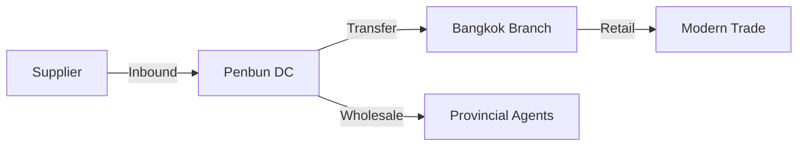

-----

# 📚 PenbunSQL — Book Distribution Center (v5.0.0)

**PenbunSQL** คือฐานข้อมูล Core System ของ **Penbun System** เวอร์ชัน 5.0.0 (Stable Release) ถูกออกแบบด้วยสถาปัตยกรรม **"Hybrid Core"** รองรับทั้งธุรกิจซื้อมาขายไป (Trading) และธุรกิจบริการ (Service) บนโครงสร้างการกระจายสินค้าแบบศูนย์กลาง (Centralized Distribution)

-----

## 📂 Documentation Structure

เอกสารประกอบโครงการที่ Developer **ต้องอ่านก่อนเริ่มงาน**:

  * **`README.md`**: (ไฟล์นี้) ภาพรวมระบบ, Business Flow และ Concept หลัก
  * **`SQL-STANDARD.md`**: กฎเหล็กการสร้างตาราง, Naming Convention, และ Audit Rules
  * **`SQL-TABLE.md`**: ลำดับการสร้างตาราง (Execution Order) และ Dependency Map

-----

## 🚀 What's New in v5.0.0

Full schema: `docs/SQL-PENBUN-v5.sql` (18 ตาราง, Generated: 2026-07-03)

* **Trigger Fixes:** เพิ่ม Trigger ที่ขาดของ `tb_book`, `tb_book_type` (auto-update-date + generate-ID) และลบ Trigger ซ้ำซ้อน/เสียใน `tb_reference`, `tb_customer_type`
* **Data Integrity:** `tb_users` common fields เปลี่ยนเป็น NOT NULL, แก้ data type ของ `tb_reference` (varchar → nvarchar)
* **Timezone Consistency:** แทนที่ `GETDATE()` ด้วย `SE Asia Standard Time` ในทุก Trigger
* **Trigger Guards:** เพิ่ม `SET NOCOUNT ON` / NESTLEVEL guards ให้ Trigger ที่ขาด (5 ตัว)
* **Indexes:** เพิ่ม Business ID unique indexes (ครบ 18 ตาราง) และ Foreign Key indexes (9 คอลัมน์)

## 🕘 What's New in v4.0.0

* **New Book Module:** เพิ่มตาราง `tb_book` และ `tb_book_type` สำหรับจัดการข้อมูลหนังสือโดยเฉพาะ
* **Multi-Company Support:** เพิ่ม `tb_company` สำหรับรองรับหลายนิติบุคคล (Multiple Entity)
* **SKU Management:** เพิ่ม `tb_product_sku` สำหรับแยกสต็อกตามรูปแบบ/เล่ม/ฉบับ (Variation Control)
* **ID Generation Fix:** ปรับ `USP_GENERATE_BUSINESS_ID` และ `USP_GENERATE_ID` ให้รองรับ Series Letter (A-Z) และ Running Number 6 หลัก (1-999999)
* **Prefix Registry Expansion:** เพิ่ม Prefix ใหม่ `BOK`, `BKT`, `CPN`, `SKU`

### 🛠️ Schema Standards Update

* **Dual Status Fields:** เพิ่ม `id_status` (NVARCHAR(20)) คู่กับ `is_active` (BIT) เพื่อรองรับสถานะแบบขยาย เช่น `ACTIVE`, `INACTIVE`, `SUSPENDED`
* **Audit Strategy:** คง Concept **"Creation is First Update"** (ใช้ `update_by` / `update_date` เท่านั้น ไม่มี `create_by` / `create_date`)
* **Standard Columns ถาวร:** `autoID`, `prefix`, `..._id`, `update_by`, `update_date`, `is_active`, `is_delete`, `id_status`

### 🏢 Company & Warehouse Structure

  * **Multi-Entity Concept:** รองรับการทำงานหลายบริษัทผ่าน `tb_company`
  * **Multi-Site Concept:** `tb_warehouse` รองรับคลังสินค้าหลายประเภท (DC, Branch, Defect, Province, International)

-----

## 🔧 Core Concept 1: Hybrid Product System

เราใช้ตารางเดียว (`tb_product`) รองรับทุกอย่าง โดยควบคุมพฤติกรรมผ่าน **Logic Flag**:

| สินค้า (Product) | Group | count\_stock | พฤติกรรมระบบ (System Behavior) |
| :--- | :--- | :--- | :--- |
| **Harry Potter Vol.1** | BOOK | **1 (True)** | ✅ ตัดสต็อก, 📦 เช็คคงเหลือ, 🚚 ต้องจัดส่ง |
| **กล่องพัสดุ (Size A)** | LOGISTICS | **1 (True)** | ✅ ตัดสต็อก (ใช้ภายใน), 📦 เช็คคงเหลือ |
| **ค่าส่ง EMS** | SERVICE | **0 (False)** | ❌ ไม่ตัดสต็อก, 💸 บันทึกรายได้, 📄 ลงบิลทันที |
| **ค่าเช่า Cloud VPS** | IT | **0 (False)** | ❌ ไม่ตัดสต็อก, 💸 บันทึกรายได้, 🔄 ต่ออายุ |

-----

## 🏢 Core Concept 2: Warehouse & Distribution

Penbun System ใช้โมเดล **"Centralized Distribution"** (กระจายสินค้าจากศูนย์กลาง)





### 🔑 Key Roles

1.  **เพ็ญบุญจัดจำหน่าย (DC):**
      * **Role:** คลังสินค้าหลัก (Main Warehouse)
      * **Function:** รับสินค้าเข้า (Receive) และกระจายสินค้า
      * **Client:** Agent และ ร้านค้าต่างจังหวัด
2.  **เพ็ญบุญ กทม. (Branch):**
      * **Role:** สาขากระจายสินค้า (Sub Warehouse)
      * **Function:** รับสินค้าจากการโอน (Transfer) เท่านั้น (ไม่รับตรงจาก Supplier)
      * **Client:** Modern Trade (B2S, นายอินทร์)

-----

## 🛠️ Schema Standards (Strict v4.0+ / Current v5.0)

ทุกตารางในระบบ (Master & Transaction) ต้องมีโครงสร้างมาตรฐานดังนี้:

| Field | Type | Function |
| :--- | :--- | :--- |
| `autoID` | `INT IDENTITY` | **PK:** สำหรับ System Join/Paging |
| `prefix` | `NVARCHAR(3)` | **ID:** รหัสย่อตาราง (กำหนดโดย Prefix Registry) |
| `..._id` | `NVARCHAR(50)` | **Business ID:** รหัสอ้างอิงทางธุรกิจ (Gen by Trigger) |
| `update_by` | `NVARCHAR(50)` | **Audit:** ผู้ทำรายการล่าสุด (Default: 'System') |
| `update_date` | `DATETIME` | **Audit:** เวลาทำรายการ (Default: Current Time) |
| `is_active` | `BIT` | **Status:** 1=ใช้งาน, 0=ระงับ (Default: 1) |
| `is_delete` | `BIT` | **Status:** 1=ลบแบบ Soft Delete (Default: 0) |
| `id_status` | `NVARCHAR(20)` | **Extended Status:** `ACTIVE`, `INACTIVE`, `SUSPENDED` ฯลฯ (Default: 'ACTIVE') |

> **💡 Note:**
>
>   * **INSERT:** `update_date` จะถูกเติมค่าอัตโนมัติจาก Default Constraint; `id_status` Default = 'ACTIVE'
>   * **UPDATE:** `update_date` จะถูกเปลี่ยนค่าจาก Trigger (`AFTER UPDATE`)
>   * **Dual Status:** `is_active` (BIT) ใช้สำหรับกรองข้อมูลในการ Query ทั่วไป; `id_status` (NVARCHAR) ใช้สำหรับแสดงผลและระบุสถานะแบบขยาย

-----

## 💾 Table Catalog (By Layer)

อ้างอิงลำดับการสร้างจาก `SQL-TABLE.md` เพื่อป้องกัน Foreign Key Error

### Layer 1: System Core

| Prefix | Table Name | รายละเอียด |
| :--- | :--- | :--- |
| **USR** | `tb_users` | ผู้ใช้งานระบบ (System Users) |
| **REF** | `tb_reference` | ตาราง Running Number |
| **CPN** | `tb_company` | **(New)** ข้อมูลนิติบุคคล (Company Profile) |

### Layer 2: Master Independent (Config)

| Prefix | Table Name | รายละเอียด |
| :--- | :--- | :--- |
| **UNT** | `tb_unit_type` | หน่วยนับ (Unit) |
| **PFM** | `tb_product_format_type` | รูปแบบสินค้า (Format) |
| **PCT** | `tb_product_category` | หมวดหมู่หลัก (Category) |
| **VET** | `tb_vendor_type` | ประเภทคู่ค้า |
| **CUT** | `tb_customer_type` | ประเภทลูกค้า (เพิ่ม `base_credit_day`) |
| **DCT** | `tb_discount_type` | ประเภทส่วนลด |
| **WHS** | `tb_warehouse` | คลังสินค้า (DC/Branch/Defect/Province/International) |
| **BKT** | `tb_book_type` | **(New)** ประเภทหนังสือ (Book Label) |

### Layer 3: Master Dependent (Partners & Groups)

| Prefix | Table Name | รายละเอียด |
| :--- | :--- | :--- |
| **PGT** | `tb_product_group` | กลุ่มธุรกิจ (Business Unit) |
| **VEN** | `tb_vendor` | คู่ค้า (Supplier/Vendor) |
| **CUS** | `tb_customer` | ลูกค้า (Customer) |
| **DSC** | `tb_discount` | แคมเปญส่วนลด |

### Layer 4: Core Product & Book

| Prefix | Table Name | รายละเอียด |
| :--- | :--- | :--- |
| **PDT** | `tb_product` | สินค้าและบริการทั้งหมด (Hybrid Core Table) |
| **SKU** | `tb_product_sku` | **(New)** SKU Variations (แยกตามเล่ม/ฉบับ/รูปแบบ) |
| **BOK** | `tb_book` | **(New)** ข้อมูลหนังสือ (Book Master) |

### Layer 5: Transactions

> ระบบ Transaction (Inbound/Outbound) อยู่ในระหว่างการออกแบบสำหรับเวอร์ชันถัดไป

| Prefix | Table Name | รายละเอียด |
| :--- | :--- | :--- |
| — | — | *(กำลังพัฒนา)* |

-----

## ⚙️ Developer Guide (SQL Usage)

### 1\. การสร้างข้อมูลใหม่ (Insert)

ไม่ต้องระบุ `..._id`, `update_date` และ `id_status` ระบบจัดการให้

```sql
INSERT INTO tb_product (product_code, product_name, count_stock, update_by)
VALUES ('8850001', 'สินค้าทดสอบ', 1, 'SystemAdmin');

-- Result: 
-- product_id = 'PDTA000001' (Generated)
-- update_date = 2025-12-10 10:00:00 (Default)
-- id_status = 'ACTIVE' (Default)
```

### 2\. การลบข้อมูล (Soft Delete)

ห้ามใช้ `DELETE` ให้ใช้ `UPDATE is_delete = 1`

```sql
UPDATE tb_product 
SET is_delete = 1, update_by = 'Admin01'
WHERE product_id = 'PDTA000001';
```

### 3\. การ Query ตามสถานะ

ใช้ `is_active` สำหรับกรองข้อมูลทั่วไป, ใช้ `id_status` สำหรับสถานะแบบขยาย

```sql
-- ดึงเฉพาะข้อมูลที่ใช้งานได้
SELECT * FROM tb_product WHERE is_active = 1 AND is_delete = 0;

-- ดึงตาม Extended Status
SELECT * FROM tb_customer_type WHERE id_status = 'ACTIVE';
```

### 4\. การเพิ่ม SKU (Product Variation)

```sql
INSERT INTO tb_product_sku (ref_product_id, barcode, variation_name, issue_no, cost_price, sell_price, update_by)
VALUES ('PDTA000001', '885000100001', 'ฉบับปกแข็ง', '1', 120.00, 250.00, 'SystemAdmin');
```

### 5\. ข้อจำกัดปัจจุบัน (Current Limitations)

  * ระบบยังไม่มี Transaction Layer (Inbound/Outbound) — อยู่ในระหว่างพัฒนา
  * **Next Phase:** `tb_receive_note`, `tb_order`, `tb_transfer` และ `tb_product_stock` (แยกยอดตาม warehouse)

-----

## 🪪 License

Copyright © 2025 PlayDevX
All Rights Reserved.
Licensed under the **PENBUN License**.
