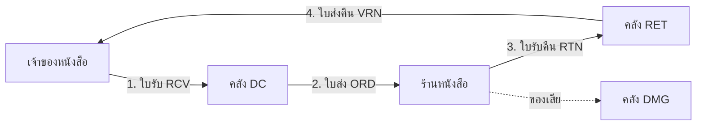
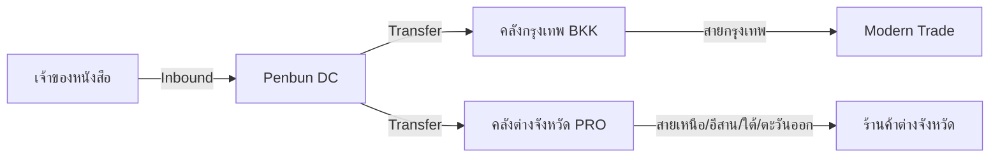

-----

# 📚 PenbunSQL — Book Distribution Center (v8.0.0)

**PenbunSQL** คือฐานข้อมูล Core System ของ **Penbun System** เวอร์ชัน 8.0.0 ถูกออกแบบด้วยสถาปัตยกรรม **"Hybrid Core"** รองรับทั้งธุรกิจซื้อมาขายไป (Trading), ธุรกิจบริการ (Service) และ **ธุรกิจฝากขาย (Consignment)** บนโครงสร้างการกระจายสินค้าแบบศูนย์กลาง (Centralized Distribution)

> ⚠️ **v8 เป็น Full Rebuild** — `SQL/SQL-PENBUN-v8.sql` มี `DROP` ทั้งฐานข้อมูลใน SECTION 1
> ห้ามรันร่วมกับ v5 / v6 / v7 และต้องสำรองข้อมูลก่อนเสมอ

-----

## 📂 Documentation Structure

เอกสารประกอบโครงการที่ Developer **ต้องอ่านก่อนเริ่มงาน**:

  * **`README.md`**: (ไฟล์นี้) ภาพรวมระบบ, Business Flow และ Concept หลัก
  * **`SQL-STANDARD.md`**: กฎเหล็กการสร้างตาราง, Naming Convention, และ Audit Rules
  * **`SQL-TABLE.md`**: ลำดับการสร้างตาราง (Execution Order) และ Dependency Map
  * **`SQL/SQL-PENBUN-v11.sql`**: Full standalone build ล่าสุด (34 ตาราง · 33 View · 11 Procedure ·
    1 Function, 5,029 บรรทัด) — v10 ทั้งก้อน บวก `vw_users`: Read Model ของผู้ใช้งาน
    ที่ JOIN คลังประจำตัวมาให้ และ **ไม่คืน** `user_password` กับ `counting_password_fail`
    หน้าจอ "ผู้ใช้และสิทธิ์" ฝั่ง PenbunWeb อ่านผ่าน View นี้ ส่วน `auth` ยังอ่าน `tb_users`
    ตรงเหมือนเดิมเพราะต้องการ hash ไม่มีตารางใหม่ จำนวน object เท่า v10 ทุกบรรทัดยกเว้น View
  * **`SQL/SQL-PENBUN-v10.sql`**: Full standalone build (34 ตาราง · 32 View · 11 Procedure ·
    1 Function, 4,996 บรรทัด) — v9 ทั้งก้อน บวกที่อยู่ชุดเดียวกันทั้งสี่ตาราง:
    `tb_warehouse` ได้ `sub_district` · `district` · `zip_code` และ `vw_company` คืน
    `sub_district` · `district` ที่ตารางมีมาตั้งแต่ v5 แต่ View ไม่เคย SELECT
    ไม่มีตารางใหม่ จำนวน object เท่า v9 ทุกบรรทัด
  * **`SQL/SQL-PENBUN-v9.sql`**: Full standalone build (34 ตาราง · 32 View · 11 Procedure ·
    1 Function, 4,966 บรรทัด) — v8 ทั้งก้อน บวกแม็ปส่วนลด `tb_discount_group` · `tb_price_rule` ·
    `UFN_RESOLVE_DISCOUNT` · ที่มาและกติกา: [DISCOUNT-MODEL.md](../DISCOUNT-MODEL.md)
  * **`SQL/SQL-PENBUN-v8.sql`**: Full standalone build (32 ตาราง · 30 View · 11 Procedure, 4,481 บรรทัด)
  * **`SQL/SQL-PENBUN-v7.sql`**: รุ่นก่อน เก็บไว้อ้างอิงเท่านั้น

เอกสารของโปรเจกต์พี่น้องที่กินสัญญาจากฐานข้อมูลนี้:

  * **`../PenbunAPI/README.md`**: เครื่องยนต์ CRUD และเอกสาร · แผนที่ endpoint · รูปแบบ response
  * **`../PenbunAPI/docs/DATABASE-CONTRACT.md`**: สิ่งที่ API พึ่งพาจากฐานข้อมูลนี้โดยตรง — **อ่านก่อนแก้ View หรือ Trigger**
  * **`../PenbunWeb/README.md`**: หน้าจอ และเครื่องยนต์ master data ฝั่งเว็บ
  * **`../PENBUN-TODO.md`**: งานที่เหลือของทั้งระบบ

-----

## 🚀 What's New in v8.0.0

Full schema: `SQL/SQL-PENBUN-v8.sql` — **32 ตาราง · 30 View · 11 Procedure**

v8 ไม่เพิ่มและไม่ลบตารางแม้แต่ตัวเดียว ทั้งหมดคือการปิดช่องว่างระหว่างสิ่งที่ฐานข้อมูลให้
กับสิ่งที่ PenbunAPI ต้องเขียนเอง

| # | เปลี่ยน | ปิดช่องอะไร |
| :--- | :--- | :--- |
| 1 | **View ใหม่ 18 ตัว** (12 master + 6 เอกสาร) รวมเป็น 30 | API เคยฝัง `SELECT ... FROM dbo.tb_...` ไว้ในโค้ด Go 9 จุด กำกับด้วย `TEMP:` นิยาม Read Model จึงอยู่นอกฐานข้อมูล |
| 2 | `vw_customer_route` คืน `description` + audit ครบ 4 | หน้าจอไม่มีคอลัมน์สถานะและกรองไม่ได้ ต้องประกาศ `audit:false` ฝั่งเว็บเพื่อเลี่ยง |
| 3 | `vw_book` คืน `book_description` + `barcode` / `weight_kg` / `pack_qty` | `POST /book` รับค่าเหล่านี้อยู่แล้วแต่ไม่คืนตอนอ่าน ช่องจึงเปิดมาว่างและลบค่าทิ้งตอนบันทึก |
| 4 | `doc_no` 30 → 50 ทั้งสี่เอกสาร | ตรงกับ `MaxLen` ที่ API ประกาศ ค่ายาว 31-50 เคยผ่าน validation แล้วตายที่ `INSERT` |
| 5 | `tb_book.translator` | `POST /book` รับมาตั้งแต่ v4.0.0 โดยไม่มีคอลัมน์รองรับ |
| 6 | `tb_book.complimentary_qty` (อภินันท์) | legacy 7.4 / 7.5 อ่านจากแฟ้มหนังสือ v7 ไม่มีที่เก็บ |
| 7 | `tb_users.ref_warehouse_auto` | เว็บพิมพ์ชื่อสาขาคงที่ไว้ทุกหน้าจอเพราะไม่มีที่ให้อ่าน — สาขาในระบบนี้คือคลัง |
| 8 | `posted_date` ให้ใบรับคืน + ใบส่งคืนคู่ค้า | สองเอกสารนี้ไม่บันทึกเลยว่าโพสต์เมื่อไร |
| 9 | `USP_LOCK_STOCK_KEY` + `USP_POST_*` จองล็อกเอง | เดิมล็อกอยู่ฝั่ง API เท่านั้น คนรัน proc จาก SSMS ข้ามการป้องกันได้ |

-----

## 🚀 What's New in v7.0.0

Full schema: `SQL/SQL-PENBUN-v7.sql` — **32 ตาราง**, standalone, ไม่มี `ALTER` (รุ่นก่อน)

| หมวด | v5.0.0 | **v7.0.0** |
| :--- | ---: | ---: |
| ตาราง | 18 | **32** |
| Foreign Key | **0** | **53** |
| CHECK Constraint | 0 | 11 |
| View | 0 | 12 |
| Stored Procedure | 0 ⚠️ | 10 |
| Trigger | 32 | 127 |
| Index | 26 | 114 |

### 1. 🔗 Referential Integrity ใช้งานได้จริง (0 → 53 FK)

v5 ผูก Foreign Key ไม่ได้เลย เพราะ Business ID เป็น `NULL` ตอน `INSERT` (Trigger เติมทีหลัง) จึงต้องใช้ *filtered unique index* ซึ่ง **SQL Server ไม่ยอมให้รองรับ FOREIGN KEY**

v7 แก้ด้วยการให้ทุกความสัมพันธ์อ้างอิงผ่าน **`ref_<parent>_auto` (INT → `autoID` ซึ่งเป็น PK)**

  * ✅ ผูก FK ได้ 100% ทั้ง 32 ตาราง
  * ⚡ Index เล็กลง ~25 เท่า (`INT` 4 byte แทน `NVARCHAR(50)` 100 byte)
  * 🔒 FK แบบ `NO ACTION` ทำให้ลบตารางแม่ที่มีลูกอ้างอยู่ไม่ได้

**Business ID ยังอยู่ครบทุกตาราง** สร้างโดย Trigger เหมือนเดิม ใช้เป็น key ที่ผู้ใช้และ API เห็น — อ่านผ่าน **View**

### 2. 📖 `tb_book` ไม่ลอยอีกต่อไป

v5 ให้ `tb_book` มีแค่ `book_name` / `author` / `price` และ**ไม่ผูกกับ `tb_product` เลย** ⇒ ข้อมูลหนังสือซ้ำ 2 ที่ ขัดกับเป้าหมาย Centralize Data

v7 ทำเป็น **Extension 1:1 ของ `tb_product`** (`UQ_tb_book_product`) พร้อมฟิลด์ตามหน้าจอ legacy: `ref_book_type_auto`, `isbn`, `cover_price`, `net_price`, `vendor_discount_percent`, `customer_discount_percent`, `effective_date`

### 3. 📒 Stock Ledger — Ledger คือความจริง, Balance คือ Cache

| ตาราง | บทบาท | กู้คืนได้ |
| :--- | :--- | :--- |
| `tb_stock_movement` | **Ledger** (append-only) | — คือความจริง |
| `tb_product_stock` | Cache ยอดคงเหลือ | `USP_REBUILD_STOCK_CACHE` |
| `tb_consign_balance` | Cache ยอดฝากขายคงค้าง | `USP_REBUILD_CONSIGN_BALANCE` |

ถ้ายอดเพี้ยน **สืบย้อนได้ว่าเพี้ยนที่เอกสารใบไหน** ผ่าน `doc_table` + `doc_auto` และสร้างใหม่ได้ทั้งระบบ

### 4. 🚚 Route + Consignment + Transaction Layer (14 ตารางใหม่)

Transaction Layer ที่ v5 เขียนว่า *"อยู่ในระหว่างการออกแบบ"* — v7 ทำครบแล้ว

### 5. 🛡️ ปิด Hard Delete สองชั้นที่ระดับ DB

  * `TRIG_BLOCK_DELETE_*` (`INSTEAD OF DELETE`) แปลง `DELETE` เป็น Soft Delete อัตโนมัติทุกตาราง
  * `FOREIGN KEY NO ACTION` บล็อกการลบตารางแม่ที่ยังมีลูกอ้างอยู่

> กฎ *"ห้ามใช้ DELETE"* จากเดิมที่เป็นแค่ข้อตกลงใน README ตอนนี้**บังคับใช้จริงโดยฐานข้อมูล**

### 6. 🧹 ล้างหนี้ทางเทคนิคของ v5

  * เพิ่ม `USP_ALLOCATE_BUSINESS_ID_BLOCK` — v5 เรียก `USP_GENERATE_BUSINESS_ID` ใน 24 Trigger แต่**ไม่มี source ใน repo**
  * ID Trigger เปลี่ยนจาก `CURSOR` เป็น **SET-BASED** (ใบส่ง 500 บรรทัด: แตะ `tb_reference` 500 ครั้ง → **1 ครั้ง**)
  * ลบ computed column `tb_warehouse.location` (ตัวที่ทำให้ `INSERT` พัง) ใส่ `address` / `province` จริงแทน
  * เพิ่ม `TRIG_SYNC_STATUS_*` บังคับ invariant: `is_delete = 1` ⇒ `is_active = 0` + `id_status = 'DELETED'`
  * เพิ่ม `CHECK` constraint คุมค่าสถานะทั้ง 11 จุด
  * เติมฟิลด์ตาม Legacy GUI Doc: `tb_customer` → `is_vat`, `invoice_format`, `discount_group`, `report_name` · `tb_vendor` → `branch_code` + ธนาคาร + เงื่อนไขฝากขาย · `tb_product_sku` → `cover_price`, `pack_qty`, `publication_date`, `return_deadline`
  * `tb_users` เพิ่มฟิลด์ตาม Authentication Spec (M001): `counting_password_fail`, `status_user_locked`, `status_change_pw`, `last_login_date`
  * Seed `tb_vendor_type` จัดใหม่ — เพิ่ม 6 หมวดที่ไม่ใช่หนังสือ (ขนส่ง / IT / โทรคมนาคม / สาธารณูปโภค / เครื่องเขียน / Outsource) และย้ายหมวดที่เป็นลูกค้าไป `tb_customer_type`

-----

## 🔧 Core Concept 1: Hybrid Product System

เราใช้ตารางเดียว (`tb_product`) รองรับทุกอย่าง โดยควบคุมพฤติกรรมผ่าน **Logic Flag**:

| สินค้า (Product) | Category | `count_stock` | พฤติกรรมระบบ |
| :--- | :--- | :--- | :--- |
| **Harry Potter Vol.1** | BOOK | **1 (True)** | ✅ ตัดสต็อก, 📦 เช็คคงเหลือ, 🚚 ต้องจัดส่ง |
| **นิตยสารรายเดือน ฉบับ 142** | MAGZ | **1 (True)** | ✅ ตัดสต็อก, 📅 มีกำหนดรับคืน, 🔄 ออกเป็นงวด |
| **กล่องพัสดุ (Size A)** | PACK | **1 (True)** | ✅ ตัดสต็อก (ใช้ภายใน) |
| **ค่าส่ง EMS** | SERVICE | **0 (False)** | ❌ ไม่ตัดสต็อก, 💸 บันทึกรายได้ |
| **ค่าเช่า Cloud VPS** | IT | **0 (False)** | ❌ ไม่ตัดสต็อก, 🔄 ต่ออายุ |

-----

## 🤝 Core Concept 2: Consignment (ฝากขาย)

ธุรกิจหลักของเพ็ญบุญคือ **ฝากขาย** ไม่ใช่ซื้อขาด — `tb_vendor.trade_type` แยกสองโหมด



| ขั้น | เอกสาร | Stored Procedure | ผลต่อสต็อก |
| :--- | :--- | :--- | :--- |
| 1 | ใบรับหนังสือ | `USP_POST_RECEIVE` | `RECEIVE` → DC |
| 2 | ใบส่งหนังสือ | `USP_POST_ORDER` | `ISSUE` ← DC + เพิ่มยอดฝากขาย |
| 3 | ใบรับคืนจากร้าน | `USP_POST_RETURN` | `RETURN_IN` → RET / DMG + ลดยอดฝากขาย |
| 4 | ใบส่งคืนเจ้าของ | `USP_POST_VENDOR_RETURN` | `RETURN_OUT` ← RET |

**ยอดขายสุทธิ = ยอดส่ง − ยอดคืน** ใช้เป็นฐานจ่ายเจ้าของหนังสือ (`consign_share_percent`)

-----

## 🏢 Core Concept 3: Warehouse, Route & Distribution



### 🗺️ Route (สายจัดจำหน่าย)

Legacy มี **3 ระบบซ้อนกัน** — v7 เก็บได้ทั้งหมดผ่าน `tb_route.route_type`

| `route_type` | ความหมาย | ตัวอย่าง Seed |
| :--- | :--- | :--- |
| `REGION` | ตามภาค | `BKK`, `NTH`, `NEA`, `STH`, `EST` |
| `LEGACY_LINE` | สายจัดจำหน่ายเดิม | `L1` – `L5` |
| `DAILY` | สายรายวัน (สิ่งพิมพ์รายวัน) | `DLY` |

ลูกค้า 1 ราย อยู่ได้**หลายสาย** (M:N ผ่าน `tb_customer_route`) แต่มี **สายหลักได้สายเดียว** (`is_primary`, บังคับด้วย filtered unique index)

### 🏬 Warehouse Types

| Code | Type | บทบาท |
| :--- | :--- | :--- |
| `DC` | `DC` | คลังหลัก รับสินค้าเข้าจากเจ้าของหนังสือ |
| `BKK` | `BRANCH` | สาขากรุงเทพ (รหัสเดิม 21) — รับจากการโอนเท่านั้น |
| `PRO` | `PROVINCE` | สาขาต่างจังหวัด (รหัสเดิม 11) |
| `RET` | `RETURN` | พักของที่ร้านคืน ก่อนส่งคืนเจ้าของ |
| `DMG` | `DAMAGED` | สินค้าชำรุด |
| `INT` | `INTERNATIONAL` | คลังต่างประเทศ (คลังเดียวที่ `allow_negative_stock = 1`) |

-----

## 📊 Core Concept 4: Allocation History ("ดึงจากประวัติ")

`tb_allocation_history` เก็บยอดส่ง/คืนต่องวด พร้อม computed column `qty_sold` และ `sell_through_pct`

`USP_PULL_ALLOCATION_FROM_HISTORY` เสนอยอดจัดส่งงวดใหม่ได้ **3 โหมด**:

| Mode | ตรรกะ |
| :--- | :--- |
| `LAST` | ยอดส่งงวดล่าสุด — พฤติกรรมเดิมของโปรแกรม legacy |
| `AVG` | เฉลี่ยยอดส่ง N งวด |
| **`SOLD`** | **ยอดขายสุทธิ (ส่ง − คืน) งวดล่าสุด** ← default |

> Proc **คืนเป็นข้อเสนอเท่านั้น ไม่เขียนทับอัตโนมัติ** — ผู้ใช้ปรับก่อนยืนยันเหมือนหน้าจอเดิม

-----

## 🛠️ Schema Standards (Strict v4.0+ / Current v7.0)

ทุกตารางในระบบต้องมีโครงสร้างมาตรฐานดังนี้:

| Field | Type | Function |
| :--- | :--- | :--- |
| `autoID` | `INT IDENTITY` | **PK:** ใช้เป็นเป้าหมายของ Foreign Key ทั้งระบบ |
| `prefix` | `NVARCHAR(3)` | **ID:** รหัสย่อตาราง (กำหนดโดย Prefix Registry) |
| `..._id` | `NVARCHAR(50)` | **Business ID:** รหัสอ้างอิงทางธุรกิจ (Gen by Trigger) |
| `ref_..._auto` | `INT` | **FK:** อ้างอิง `autoID` ของตารางแม่ |
| `update_by` | `NVARCHAR(50)` | **Audit:** ผู้ทำรายการล่าสุด (Default: 'System') |
| `update_date` | `DATETIME` | **Audit:** เวลาทำรายการ (SE Asia Standard Time) |
| `is_active` | `BIT` | **Status:** 1=ใช้งาน, 0=ระงับ (Default: 1) |
| `is_delete` | `BIT` | **Status:** 1=ลบแบบ Soft Delete (Default: 0) |
| `id_status` | `NVARCHAR(20)` | **Extended Status:** `ACTIVE`, `INACTIVE`, `DELETED` ฯลฯ |

> **💡 Note:**
>
>   * **INSERT:** `update_date` / `id_status` เติมจาก Default; Business ID เติมจาก Trigger
>   * **UPDATE:** `update_date` เปลี่ยนค่าจาก Trigger (`AFTER UPDATE`)
>   * **Status Invariant (ใหม่ใน v7):** ตั้ง `is_delete = 1` เมื่อไหร่ Trigger จะบังคับ `is_active = 0` และ `id_status = 'DELETED'` ให้อัตโนมัติ — v5 ไม่มีกฎนี้ ทำให้ข้อมูลจริงเพี้ยนได้
>   * **Creation is First Update:** ไม่มี `create_by` / `create_date` ทุกตาราง

### 🔤 Prefix Registry (32 ตัว)

| Layer | Prefix |
| :--- | :--- |
| System | `REF` `USR` |
| Lookup | `CPN` `CUT` `VET` `DCT` `PCT` `PFM` `UNT` `BKT` |
| Master | `PGT` `WHS` `VEN` `CUS` `DSC` |
| Product | `PDT` `SKU` `BOK` |
| Route | `RTE` `CRT` |
| Stock | `STM` `STK` `CSB` |
| Transaction | `RCV` `RCI` `ORD` `ODI` `RTN` `RTI` `VRN` `VRI` |
| History | `AHS` |

-----

## 💾 Table Catalog (By Layer)

ลำดับใน `SQL/SQL-PENBUN-v8.sql` คือ Dependency Order — ห้ามสลับ เพราะมี Foreign Key จริง

### Layer 0: System

| Prefix | Table | รายละเอียด |
| :--- | :--- | :--- |
| **REF** | `tb_reference` | ตาราง Running Number (PK = `ref_id`) |
| **USR** | `tb_users` | ผู้ใช้งานระบบ + ฟิลด์ Auth ตาม M001 |

### Layer 1: Lookup

| Prefix | Table | รายละเอียด |
| :--- | :--- | :--- |
| **CPN** | `tb_company` | นิติบุคคล / บริษัทในเครือ |
| **CUT** | `tb_customer_type` | ประเภทลูกค้า (`base_credit_day`) |
| **VET** | `tb_vendor_type` | ประเภทคู่ค้า (24 หมวด ครอบคลุม non-book) |
| **DCT** | `tb_discount_type` | ประเภทส่วนลด |
| **PCT** | `tb_product_category` | หมวดสินค้า (ชั้นบนสุด) |
| **PFM** | `tb_product_format_type` | รูปแบบสินค้า |
| **UNT** | `tb_unit_type` | หน่วยนับ |
| **BKT** | `tb_book_type` | ประเภทหนังสือ (legacy: Bookcatgid) |

### Layer 2–3: Master

| Prefix | Table | รายละเอียด |
| :--- | :--- | :--- |
| **PGT** | `tb_product_group` | กลุ่มสินค้า → `tb_product_category` |
| **WHS** | `tb_warehouse` | คลังสินค้า + `warehouse_type` |
| **VEN** | `tb_vendor` | คู่ค้า + `trade_type` + ธนาคาร + เงื่อนไขฝากขาย |
| **CUS** | `tb_customer` | ลูกค้า + `is_vat` / `invoice_format` / `discount_group` |
| **DSC** | `tb_discount` | แคมเปญส่วนลด |

### Layer 4–5: Product

| Prefix | Table | รายละเอียด |
| :--- | :--- | :--- |
| **PDT** | `tb_product` | Hybrid Core — สินค้าและบริการทั้งหมด |
| **SKU** | `tb_product_sku` | SKU / ฉบับ (legacy: เมนู Product = เพิ่มฉบับ) |
| **BOK** | `tb_book` | **Extension 1:1 ของ `tb_product`** |

### Layer 6: Route

| Prefix | Table | รายละเอียด |
| :--- | :--- | :--- |
| **RTE** | `tb_route` | สายจัดจำหน่าย (3 `route_type`) |
| **CRT** | `tb_customer_route` | ผูกลูกค้ากับสาย (M:N) + ลำดับจุดจอด |

### Layer 7: Stock

| Prefix | Table | รายละเอียด |
| :--- | :--- | :--- |
| **STM** | `tb_stock_movement` | **Ledger** — ความจริงของสต็อก |
| **STK** | `tb_product_stock` | Cache ยอดคงเหลือ ต่อ SKU × คลัง |
| **CSB** | `tb_consign_balance` | Cache ยอดฝากขายคงค้าง ต่อ ลูกค้า × SKU |

### Layer 8: Transactions

| Prefix | Table | รายละเอียด |
| :--- | :--- | :--- |
| **RCV / RCI** | `tb_receive_note` / `_item` | ใบรับหนังสือเข้าคลัง |
| **ORD / ODI** | `tb_order` / `tb_order_item` | ใบส่งหนังสือ |
| **RTN / RTI** | `tb_return_note` / `_item` | ใบรับคืนจากร้าน |
| **VRN / VRI** | `tb_vendor_return_note` / `_item` | ใบส่งคืนเจ้าของหนังสือ |

### Layer 9: History

| Prefix | Table | รายละเอียด |
| :--- | :--- | :--- |
| **AHS** | `tb_allocation_history` | ประวัติยอดส่ง/คืนต่องวด |

-----

## 🔍 View Catalog (Read Model)

**PenbunAPI ควรอ่านผ่าน View เสมอ** เพราะ View แปลง `autoID` → Business ID ให้แล้ว ไม่ต้องเขียน `JOIN` เอง

| View | ใช้กับ |
| :--- | :--- |
| `vw_product` | รายการสินค้า + group / category / format / unit / vendor |
| `vw_product_sku` | SKU + ข้อมูล product ต้นสังกัด |
| `vw_book` | หนังสือ + product + book_type + vendor |
| `vw_customer` | ลูกค้า + ประเภท + `base_credit_day` |
| `vw_vendor` | คู่ค้า + ประเภท + เงื่อนไขฝากขาย + ธนาคาร |
| `vw_customer_route` | ลูกค้าอยู่สายไหนบ้าง |
| `vw_stock_onhand` | ยอดคงเหลือ ต่อ SKU × คลัง |
| `vw_stock_movement` | รายการเคลื่อนไหวสต็อก (audit trail) |
| `vw_consign_outstanding` | ยอดฝากขายคงค้างที่ร้าน |
| `vw_order_header` / `vw_order_item` | ใบส่งหนังสือ |
| `vw_allocation_history` | ประวัติยอดส่ง/คืน + `sell_through_pct` |

-----

## ⚙️ Stored Procedure Catalog (Write Model)

### Infrastructure

| Procedure | หน้าที่ |
| :--- | :--- |
| `USP_ALLOCATE_BUSINESS_ID_BLOCK` | จองเลขรันนิ่งเป็นบล็อก (เรียกโดย Trigger เท่านั้น) |
| `USP_GENERATE_BUSINESS_ID` | Wrapper แบบทีละแถว (เพื่อความเข้ากันได้) |

### Stock Engine

| Procedure | หน้าที่ |
| :--- | :--- |
| **`USP_APPLY_STOCK_MOVEMENT`** | **จุดเดียวที่แตะสต็อกได้** — เขียน Ledger แล้วปรับ Cache |
| `USP_REBUILD_STOCK_CACHE` | สร้าง `tb_product_stock` ใหม่จาก Ledger |
| `USP_REBUILD_CONSIGN_BALANCE` | สร้าง `tb_consign_balance` ใหม่จากเอกสารที่ POST แล้ว |

### Business Workflow

| Procedure | หน้าที่ |
| :--- | :--- |
| `USP_POST_RECEIVE` | ยืนยันใบรับ → เพิ่มสต็อก |
| `USP_POST_ORDER` | ยืนยันใบส่ง → ตัดสต็อก + เพิ่มยอดฝากขาย + บันทึกประวัติ |
| `USP_POST_RETURN` | ยืนยันใบรับคืน → แยก GOOD/DAMAGED เข้าคนละคลัง |
| `USP_POST_VENDOR_RETURN` | ยืนยันใบส่งคืนเจ้าของ → ตัดคลัง RET |
| `USP_PULL_ALLOCATION_FROM_HISTORY` | "ดึงจากประวัติ" 3 โหมด |

> ทุก `USP_POST_*` บังคับให้เอกสารอยู่สถานะ `CONFIRMED` ก่อน และทำงานใน transaction เดียว

-----

## ⚙️ Developer Guide

### 1. การสร้างข้อมูลใหม่ (Insert)

ไม่ต้องระบุ `..._id`, `update_date`, `id_status` — ระบบจัดการให้
แต่ **ต้องส่ง `ref_*_auto`** ไม่ใช่ Business ID

```sql
DECLARE @grp INT = (SELECT autoID FROM tb_product_group WHERE product_group_name = N'วรรณกรรม/นิยาย');

INSERT INTO tb_product (ref_product_group_auto, product_code, product_name, count_stock, update_by)
VALUES (@grp, '8850001', N'สินค้าทดสอบ', 1, 'SystemAdmin');

-- Result:
--   product_id  = 'PDTA000001'  (Trigger)
--   update_date = SE Asia now   (Default)
--   id_status   = 'ACTIVE'      (Default)
```

### 2. การอ่านข้อมูล — ใช้ View

```sql
-- ✅ ได้ Business ID ครบโดยไม่ต้อง JOIN
SELECT * FROM vw_product WHERE product_id = 'PDTA000001';

-- ❌ อย่าทำแบบนี้ จะได้แค่ ref_*_auto ที่อ่านไม่รู้เรื่อง
SELECT * FROM tb_product WHERE product_id = 'PDTA000001';
```

### 3. การลบข้อมูล (Soft Delete)

```sql
UPDATE tb_product SET is_delete = 1, update_by = 'Admin01'
WHERE product_id = 'PDTA000001';
-- Trigger จะตั้ง is_active = 0 และ id_status = 'DELETED' ให้อัตโนมัติ
```

> ถ้าเผลอสั่ง `DELETE` ระบบจะ**ไม่ error แต่แปลงเป็น Soft Delete ให้แทน** (`TRIG_BLOCK_DELETE_*`)

### 4. การจัดการสต็อก — ห้ามแตะตารางตรง ๆ

```sql
-- ✅ ถูก
EXEC USP_APPLY_STOCK_MOVEMENT
     @SkuAuto = 12, @WarehouseAuto = 1, @MovementType = N'ADJUST',
     @QtyChange = -5, @UpdateBy = N'Admin01';

-- ❌ ผิด — Ledger จะไม่ตรงกับ Cache ตลอดกาล
UPDATE tb_product_stock SET qty_onhand = qty_onhand - 5 WHERE ...;
```

### 5. Flow การทำเอกสาร

```sql
-- 1) สร้างเอกสาร (Trigger เติม order_id ให้เอง)
INSERT INTO tb_order (ref_customer_auto, ref_warehouse_auto, doc_no, period_key, update_by) ...;
INSERT INTO tb_order_item (ref_order_auto, ref_sku_auto, line_no, qty_delivered, unit_price, update_by) ...;

-- 2) ยืนยัน
UPDATE tb_order SET doc_status = N'CONFIRMED' WHERE order_id = 'ORDA000001';

-- 3) โพสต์ — ตัดสต็อก + ยอดฝากขาย + ประวัติ ในคำสั่งเดียว
EXEC USP_POST_ORDER @OrderID = 'ORDA000001', @UpdateBy = 'Admin01';
```

### 6. ตรวจสอบหลังติดตั้ง

`SECTION 12` ในไฟล์ SQL มี query ยืนยัน — ผลที่ถูกต้อง:

```
tables 32 | views 12 | procedures 10 | foreign_keys 53
```

และ query ตัวที่สอง (`untrusted_fk`) ต้องคืน **0 แถว**

### 7. เพิ่มผู้ใช้งานลง `tb_users` (bcrypt)

`user_password` เก็บเป็น **bcrypt hash เท่านั้น** — ห้ามเก็บ plaintext และห้ามใช้ `HASHBYTES()` ของ SQL Server
(PenbunAPI ตรวจรหัสผ่านด้วย `bcrypt.CompareHashAndPassword` จาก `golang.org/x/crypto/bcrypt` ใน `internal/domain/auth/service.go`)

**1) ติดตั้งเครื่องมือสร้าง hash**

```bash
sudo apt update
sudo apt install apache2-utils -y
```

**2) สร้าง bcrypt hash (cost 10)**

```bash
htpasswd -nbBC 10 somchai 'Penbun@2026'
```

ผลลัพธ์ — ให้ตัดเอา**เฉพาะส่วนหลังเครื่องหมาย `:`**

```
somchai:$2y$10$KfQ8mU5VvJ5QGk7/LN9OeOujOPEwLjD3Oo4yEWDwEpr6/LkfuPWoK
        └──────────────── ส่วนที่นำไปใส่ user_password ────────────────┘
```

> ✅ prefix `$2y$` ใช้ได้กับ PenbunAPI — Go bcrypt ตรวจเฉพาะ major version (`2`) ไม่สนใจ minor (`a`/`b`/`y`)
> ⚠️ ครอบรหัสผ่านด้วย single quote ใน bash เสมอ ถ้ามี `$`, `!`, `#` มิฉะนั้น shell จะแปลงค่าก่อนถึง `htpasswd`
> ⚠️ อย่าตั้ง cost เกิน 12 — ทุก login จะช้าขึ้นแบบทวีคูณ

**3) INSERT ลงฐานข้อมูล**

```sql
INSERT INTO dbo.tb_users
    ([prefix], [user_name], [user_password], [user_level], [full_name], [email], [update_by])
VALUES
    (N'USR', N'somchai',
     N'$2y$10$KfQ8mU5VvJ5QGk7/LN9OeOujOPEwLjD3Oo4yEWDwEpr6/LkfuPWoK',
     N'USER', N'สมชาย ใจดี', N'somchai@penbun.local', N'Admin01');
```

| ห้ามใส่ | เหตุผล |
| :--- | :--- |
| `autoID` | `IDENTITY(1,1)` |
| `user_id` | `TRIG_GENERATE_TB_USERS_ID` เติมให้ (`USRA000002`) — ถ้าใส่มาเอง Trigger จะข้ามและเลขจะหลุด series |
| `update_date`, `is_active`, `is_delete`, `id_status`, `counting_password_fail`, `status_user_locked`, `status_change_pw` | มี `DEFAULT` ครบแล้ว |

ค่า `user_level` ที่ใช้อยู่: `ADMIN` / `USER` (ไม่มี CHECK constraint — default = `USER`)
`status_change_pw` default = `1` แปลว่า**บังคับเปลี่ยนรหัสผ่านตอน login ครั้งแรก** ตาม Authentication Spec M001

**4) ตรวจสอบ**

```sql
SELECT autoID, user_id, user_name, user_level, is_active, is_delete, status_change_pw
  FROM dbo.tb_users
 WHERE is_delete = 0
 ORDER BY autoID;
```

`user_id` ต้องไม่เป็น `NULL` — ถ้าเป็น `NULL` แปลว่า Trigger ไม่ทำงาน ให้ตรวจ `tb_reference` แถว `ref_id = 'tb_users'`

-----

#### ⛔ ห้ามใช้ `DELETE` + `DBCC CHECKIDENT RESEED` เพื่อล้างผู้ใช้

```sql
-- ❌ พังทั้งสองบรรทัด
DELETE FROM tb_users;
DBCC CHECKIDENT ('tb_users', RESEED, 0);
```

1. `TRIG_BLOCK_DELETE_TB_USERS` เป็น `INSTEAD OF DELETE` — `DELETE` จะกลายเป็น **soft delete** (`is_delete = 1`) แถวยังอยู่ในตารางครบ
2. พอ `RESEED, 0` แล้ว `INSERT` ถัดไปจะได้ `autoID = 1` ซึ่ง**ชนกับแถวเดิมที่ยังอยู่** → `PK_tb_users` violation
3. `DBCC CHECKIDENT` ไม่รีเซ็ต Business ID — ตัวนับอยู่ที่ `tb_reference.ref_int` คนละที่กับ `IDENTITY`

**ถ้าต้องการปิดการใช้งานผู้ใช้ ให้ทำแบบนี้แทน:**

```sql
-- ปิดชั่วคราว (login ไม่ได้ แต่ประวัติยังอยู่)
UPDATE dbo.tb_users SET is_active = 0, update_by = N'Admin01' WHERE user_name = N'somchai';

-- ปิดถาวร (soft delete — ปลด UQ_tb_users_user_name ให้ตั้งชื่อซ้ำใหม่ได้)
UPDATE dbo.tb_users SET is_delete = 1, is_active = 0, id_status = N'DELETED' WHERE user_name = N'somchai';

-- เปลี่ยนรหัสผ่าน (ใช้ hash ใหม่จากขั้นตอนที่ 2)
UPDATE dbo.tb_users
   SET user_password = N'$2y$10$...', status_change_pw = 1, counting_password_fail = 0,
       status_user_locked = 0, update_by = N'Admin01'
 WHERE user_name = N'somchai';
```

> 🔄 ต้องการล้างตารางจริง ๆ ให้ rebuild ทั้งฐานข้อมูลด้วย `SQL/SQL-PENBUN-v8.sql` (SECTION 1 มี `DROP` อยู่แล้ว) — อย่าล้างเฉพาะ `tb_users` เพราะ `tb_reference` จะไม่ sync

-----

## 🔄 Migration Note

**v10 → v11** เพิ่ม View เดียว ไม่แตะตารางเลย ฐานที่มีข้อมูลจริงอยู่แล้ว **ห้ามรัน
`SQL-PENBUN-v11.sql` ทั้งไฟล์** เพราะ SECTION 1 คือ `DROP` ทั้งฐาน รันแค่คำสั่งนี้พอ:

```sql
CREATE VIEW [dbo].[vw_users] AS
SELECT  u.autoID AS user_auto,
        u.user_id, u.user_name, u.full_name, u.email, u.user_level,
        u.status_user_locked, u.status_change_pw, u.last_login_date, u.remark,
        w.warehouse_id, w.warehouse_code, w.warehouse_name,
        u.is_active, u.id_status, u.update_by, u.update_date
  FROM dbo.tb_users u
  LEFT JOIN dbo.tb_warehouse w ON w.autoID = u.ref_warehouse_auto
 WHERE u.is_delete = 0;
GO
```

`GET /users` ของ PenbunAPI อ่านจาก View นี้ ถ้ายังไม่ได้รัน หน้าจอ "ผู้ใช้และสิทธิ์"
จะตอบ `Invalid object name 'dbo.vw_users'`

**v7 → v8** ไม่มีการลบหรือเปลี่ยนชนิดคอลัมน์เดิม มีแต่การเพิ่ม — ใครที่มีข้อมูลจริงอยู่แล้ว
เขียน `ALTER TABLE ... ADD` สี่คอลัมน์ (`tb_book.translator` · `tb_book.complimentary_qty` ·
`tb_users.ref_warehouse_auto` · `posted_date` สองตาราง), ขยาย `doc_no` เป็น `nvarchar(50)`,
แล้ว `CREATE VIEW` กับ `CREATE OR ALTER PROCEDURE` ตาม SECTION 9-10 ก็พอ ไม่ต้อง rebuild
ทั้งฐาน — สคริปต์ v8 ทำเป็น full rebuild เพราะรุ่นนี้ยังไม่มีข้อมูล production

## 🔄 Migration Note (v5 → v7)

v7 เป็น **Full Rebuild** ไม่ใช่ incremental — ถ้ามีข้อมูลจริงใน v5 ต้อง export แล้ว import ใหม่โดย map:

| v5 | v7 |
| :--- | :--- |
| `tb_customer.customer_type_id` (NVARCHAR) | `ref_customer_type_auto` (INT) |
| `tb_vendor.vendor_type_id` | `ref_vendor_type_auto` |
| `tb_product.product_group_id` / `vendor_id` / … | `ref_product_group_auto` / `ref_vendor_auto` / … |
| `tb_product_sku.ref_product_id` | `ref_product_auto` |
| `tb_product_group.product_category_id` | `ref_product_category_auto` |
| `tb_discount.discount_type_id` | `ref_discount_type_auto` |
| `tb_book` (ตารางลอย) | ต้องผูก `ref_product_auto` ให้ทุกแถว |

### สิ่งที่ PenbunAPI ต้องแก้ — ทำครบแล้วใน v4.0.0

| ข้อ | สถานะใน PenbunAPI v4.0.0 |
| :--- | :--- |
| `INSERT` ต้องส่ง `ref_*_auto` | ✅ `repository.Resolver` แปลง Business ID → `autoID` ที่เดียว พร้อม cache |
| `SELECT` ให้ยิงที่ View | ✅ ทุก descriptor และทุกเอกสารชี้ View ตั้งแต่ v8 — ไม่มี derived table เหลือในโค้ดแล้ว |
| ยืนยันเอกสารให้เรียก `USP_POST_*` | ✅ `domain/document` เรียก Stored Procedure ไม่จัดลำดับเอง |
| `update_by` มาจาก JWT claim | ✅ อ่านจาก token เสมอ ไม่รับจาก body หรือ query string |
| เลิก endpoint hard delete | ✅ `DELETE` ทุกเส้นทางเป็น soft delete เส้นทางรุ่นก่อนคืน `410 ENDPOINT_REMOVED` |

### ข้อจำกัดที่ PenbunAPI ยังต้องเดินอ้อม

  * **`OUTPUT` ต้องมี `INTO` เสมอ** — ทั้ง 32 ตารางมี `AFTER INSERT` trigger เติม Business ID
    SQL Server จึงปฏิเสธ `OUTPUT` ที่ไม่มี `INTO` (Msg 334) API แก้ด้วย
    `repository.InsertReturningAuto` ที่ `OUTPUT INSERTED.autoID INTO @pb_inserted`
    แล้วอ่านแถวกลับจาก View ในทรานแซกชันเดียวกัน

ที่เหลืออีกสี่ข้อปิดไปแล้วใน v8 — View ที่ขาด 12 ตัว, `vw_customer_route` ที่ไม่คืน
คอลัมน์ audit, `vw_book` ที่ไม่คืน description กับข้อมูลสินค้า และ Stored Procedure
ที่ไม่จองล็อกเอง

> **API ที่ชี้ View ต้องใช้กับ v8 ขึ้นไป** — PenbunAPI ตั้งแต่คอมมิตที่เปลี่ยน `Source`
> เป็นชื่อ View จะตอบ `Invalid object name 'dbo.vw_...'` ทันทีถ้าฐานยังเป็น v7

-----

## 📋 สมมติฐานทางธุรกิจที่ v8 ตั้งไว้

ระบุไว้ใน `SECTION 13.5` ของไฟล์ SQL — **ถ้าข้อไหนไม่ตรงกับธุรกิจจริง ต้องแก้ก่อนเริ่มใช้งาน**

| หัวข้อ | สมมติฐาน |
| :--- | :--- |
| **สาย** | เขตขาย/เส้นทางส่ง · ลูกค้าอยู่ได้หลายสาย แต่สายหลักได้สายเดียว |
| **ฝากขาย** | ส่งของออกบิลเต็ม แล้วออกใบลดหนี้ตอนคืน · จ่ายเจ้าของตามยอดขายสุทธิ · ของคืนเข้า `RET` (ของดี) / `DMG` (ของเสีย) ไม่กลับเข้า DC |
| **ดึงจากประวัติ** | Default = ยอดขายสุทธิงวดล่าสุด (`Mode = SOLD`) |
| **11 / 21** | ถือเป็นหน่วยงานในนิติบุคคลเดียว แยกด้วย warehouse `BKK` / `PRO` — ถ้าเป็นคนละนิติบุคคลจริง เพิ่มแถวใน `tb_company` แล้วผูก `ref_company_auto` ได้เลยโดยไม่ต้องแก้ schema |

-----

## 🚧 Roadmap (v9)

เรียงตามลำดับที่ปิดงานได้จริง รายละเอียดเต็มอยู่ใน `../PENBUN-TODO.md` หัวข้อ 2 และ 8

| หัวข้อ | รายละเอียด |
| :--- | :--- |
| **RBAC** | `tb_role` / `tb_permission` / `tb_role_permission` / `tb_user_role` ตาม Design Doc M002 — ปัจจุบันมีแค่ `user_level` รองรับ 1 role/user และหน้าจอผู้ใช้กับเมนูกรองสิทธิ์รออยู่ทั้งคู่ |
| **แม็ปส่วนลด** | `tb_discount_group_price` (SKU × กลุ่มลูกค้า) และ `tb_customer_sku_discount` (SKU × ลูกค้า) — กฎที่บอกว่าร้านหนึ่งจ่ายเท่าไรสำหรับหนังสือเล่มหนึ่งยังไม่มีที่อยู่ในระบบเลย `tb_order_item.discount_percent` ทุกวันนี้คือเลขที่คนกรอกเอง |
| **กระบวนงานกลับรายการ** | `USP_REVERSE_*` สำหรับเอกสารที่โพสต์ไปแล้ว ปัจจุบันต้องใช้ `/stock/adjust` แก้มือซึ่งไม่ทิ้งร่องรอยว่าแก้เพราะเอกสารใบไหน |
| **History Log** | `tb_history_group` / `tb_history_log` + `tb_configuration` ตาม Spec M001/M002 |
| **Invoice Layer** | ใบวางบิล / ใบลดหนี้ / Vendor Settlement — legacy module 7 ทั้งโมดูล 36 หน้า |
| **Multi-Company** | `ref_company_auto` บนตาราง master (รอคำตอบเรื่อง 11/21) |

-----

## 🪪 License

Copyright © 2026 PlayDevX
All Rights Reserved.
Licensed under the **PENBUN License**.
