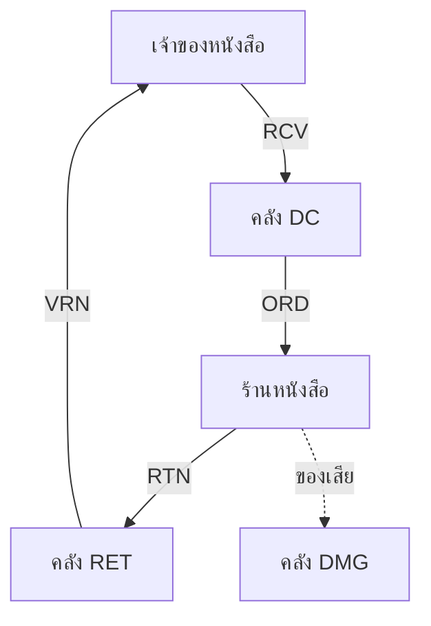

# 🏗️ PenbunSQL v7.0.0 — Execution Order & Development Roadmap

เอกสารนี้ระบุลำดับการสร้าง Object ในฐานข้อมูล PenbunSQL v7.0.0 และติดตามสถานะการพัฒนา

**SQL Script:** [`docs/SQL-PENBUN-v7.sql`](./docs/SQL-PENBUN-v7.sql) — standalone full build, 32 ตาราง

> **🚨 คำเตือน 1:** v7 เป็น **Full Rebuild** — SECTION 1 ของ script คือ `DROP` ทั้งฐานข้อมูล **สำรองข้อมูลก่อนรันเสมอ**
>
> **🚨 คำเตือน 2:** ห้ามสลับ Execution Order เด็ดขาด
> v5 เคยเตือนเรื่องนี้ทั้งที่**ยังไม่มี Foreign Key จริงสักตัว** — v7 มี **53 ตัว** คำเตือนนี้จึงเพิ่งมีผลจริงตั้งแต่เวอร์ชันนี้ สลับลำดับ = `ALTER TABLE ... ADD CONSTRAINT` จะ error ทันที

**Status Legend:**
* ✅ **Done** = สร้างและปรับปรุงตามมาตรฐานแล้ว
* ⏳ **Pending** = รอการพัฒนา

---

## 🚨 Phase 0: Prerequisites (Object ที่ต้องมีก่อนตาราง)

| Order | Status | Type | Object | Description |
| :--- | :---: | :--- | :--- | :--- |
| 0.1 | ✅ | Script | `SECTION 1 : DROP ALL` | ลบ FK → View → Procedure → Table ตามลำดับ |
| 0.2 | ✅ | Stored Proc | `USP_ALLOCATE_BUSINESS_ID_BLOCK` | **(Critical)** ตัวจองเลขรันนิ่งแบบบล็อก |
| 0.3 | ✅ | Stored Proc | `USP_GENERATE_BUSINESS_ID` | Wrapper แบบทีละแถว (backward compat) |

> **หมายเหตุสำคัญ:** v5 ระบุ `USP_GENERATE_BUSINESS_ID` เป็น Order 1 และเรียกใช้ใน Trigger 24 จุด
> แต่ **ไม่มี source code อยู่ใน repo** ⇒ ตั้ง server ใหม่แล้ว `INSERT` ทุกตารางจะพัง
> v7 บรรจุ source ของทั้งสอง proc ไว้ในไฟล์เดียวกันแล้ว

---

## 🟢 Layer 0: System Core

| Order | Status | Table | Prefix | FK Dependencies |
| :--- | :---: | :--- | :---: | :--- |
| 1 | ✅ | `tb_reference` | REF | — *(PK = `ref_id`, ไม่มี Business ID)* |
| 2 | ✅ | `tb_users` | USR | — |

---

## 🟡 Layer 1: Lookup / Master Independent

ไม่มี FK สร้างพร้อมกันได้ทั้งหมด

| Order | Status | Table | Prefix | Description |
| :--- | :---: | :--- | :---: | :--- |
| 3 | ✅ | `tb_company` | CPN | นิติบุคคล / บริษัทในเครือ |
| 4 | ✅ | `tb_customer_type` | CUT | ประเภทลูกค้า (`base_credit_day`) |
| 5 | ✅ | `tb_vendor_type` | VET | ประเภทคู่ค้า — seed ใหม่ 24 หมวด ครอบคลุม non-book |
| 6 | ✅ | `tb_discount_type` | DCT | ประเภทส่วนลด |
| 7 | ✅ | `tb_product_category` | PCT | หมวดสินค้า (ชั้นบนสุด) |
| 8 | ✅ | `tb_product_format_type` | PFM | รูปแบบสินค้า |
| 9 | ✅ | `tb_unit_type` | UNT | หน่วยนับ |
| 10 | ✅ | `tb_book_type` | BKT | ประเภทหนังสือ (legacy: Bookcatgid) |

---

## 🟠 Layer 2: Master Dependent (Level 1)

| Order | Status | Table | Prefix | FK Dependencies |
| :--- | :---: | :--- | :---: | :--- |
| 11 | ✅ | `tb_product_group` | PGT | 🔗 `tb_product_category` |
| 12 | ✅ | `tb_warehouse` | WHS | 🔗 `tb_company` |

---

## 🟤 Layer 3: Partner

| Order | Status | Table | Prefix | FK Dependencies |
| :--- | :---: | :--- | :---: | :--- |
| 13 | ✅ | `tb_vendor` | VEN | 🔗 `tb_vendor_type` |
| 14 | ✅ | `tb_customer` | CUS | 🔗 `tb_customer_type` |
| 15 | ✅ | `tb_discount` | DSC | 🔗 `tb_discount_type` |

---

## 🔴 Layer 4: Product (Hybrid Core)

| Order | Status | Table | Prefix | FK Dependencies | Logic |
| :--- | :---: | :--- | :---: | :--- | :--- |
| 16 | ✅ | `tb_product` | PDT | 🔗 `tb_product_group`<br>🔗 `tb_product_format_type`<br>🔗 `tb_unit_type`<br>🔗 `tb_vendor` | **Hybrid Core:** flag `count_stock` (1=นับสต็อก, 0=บริการ) |

---

## 🟣 Layer 5: SKU & Book

| Order | Status | Table | Prefix | FK Dependencies | Note |
| :--- | :---: | :--- | :---: | :--- | :--- |
| 17 | ✅ | `tb_product_sku` | SKU | 🔗 `tb_product` | SKU / ฉบับ (legacy: เมนู Product) |
| 18 | ✅ | `tb_book` | BOK | 🔗 `tb_product`<br>🔗 `tb_book_type` | **🆕 Extension 1:1 ของ `tb_product`** |

> **⚠️ เปลี่ยนจาก v5:** เดิม `tb_book` **ไม่มี FK เลย** เป็นตารางลอยที่ไม่เชื่อมกับ `tb_product`
> ทำให้ข้อมูลหนังสือซ้ำ 2 ที่ ขัดกับเป้าหมาย Centralize Data
> v7 บังคับ 1:1 ด้วย `UQ_tb_book_product ON (ref_product_auto)`

---

## 🔵 Layer 6: Route (สายจัดจำหน่าย)

| Order | Status | Table | Prefix | FK Dependencies | Note |
| :--- | :---: | :--- | :---: | :--- | :--- |
| 19 | ✅ | `tb_route` | RTE | 🔗 `tb_warehouse` | 3 `route_type`: REGION / LEGACY_LINE / DAILY |
| 20 | ✅ | `tb_customer_route` | CRT | 🔗 `tb_customer`<br>🔗 `tb_route` | M:N + สายหลักได้สายเดียว |

---

## ⚫ Layer 7: Stock (Ledger + Cache)

| Order | Status | Table | Prefix | FK Dependencies | ประเภท |
| :--- | :---: | :--- | :---: | :--- | :--- |
| 21 | ✅ | `tb_stock_movement` | STM | 🔗 `tb_product_sku`<br>🔗 `tb_warehouse`<br>🔗 `tb_customer`<br>🔗 `tb_vendor` | **Ledger** (append-only) |
| 22 | ✅ | `tb_product_stock` | STK | 🔗 `tb_product_sku`<br>🔗 `tb_warehouse` | Cache |
| 23 | ✅ | `tb_consign_balance` | CSB | 🔗 `tb_customer`<br>🔗 `tb_product_sku` | Cache |

> **กฎ:** ห้าม `UPDATE` ตาราง Cache ตรง ๆ ให้เรียก `USP_APPLY_STOCK_MOVEMENT` เสมอ

---

## 🟩 Layer 8: Transaction Documents

| Order | Status | Table | Prefix | Type | FK Dependencies |
| :--- | :---: | :--- | :---: | :--- | :--- |
| 24 | ✅ | `tb_receive_note` | RCV | Header | 🔗 `tb_vendor` 🔗 `tb_warehouse` 🔗 `tb_company` |
| 25 | ✅ | `tb_receive_item` | RCI | Item | 🔗 `tb_receive_note` 🔗 `tb_product_sku` |
| 26 | ✅ | `tb_order` | ORD | Header | 🔗 `tb_customer` 🔗 `tb_route` 🔗 `tb_warehouse` 🔗 `tb_company` |
| 27 | ✅ | `tb_order_item` | ODI | Item | 🔗 `tb_order` 🔗 `tb_product_sku` |
| 28 | ✅ | `tb_return_note` | RTN | Header | 🔗 `tb_customer` 🔗 `tb_route` 🔗 `tb_warehouse` 🔗 `tb_order` |
| 29 | ✅ | `tb_return_item` | RTI | Item | 🔗 `tb_return_note` 🔗 `tb_product_sku` |
| 30 | ✅ | `tb_vendor_return_note` | VRN | Header | 🔗 `tb_vendor` 🔗 `tb_warehouse` 🔗 `tb_company` |
| 31 | ✅ | `tb_vendor_return_item` | VRI | Item | 🔗 `tb_vendor_return_note` 🔗 `tb_product_sku` |

> **⚠️ เปลี่ยนจาก v5:** ตาราง Item มี Prefix และ Business ID ครบเหมือนตาราง Header แล้ว
> (v4/v5 กำหนดว่าไม่ต้องมี — ดูเหตุผลใน `SQL-STANDARD.md` หัวข้อ 3.2)
>
> Transaction ทั้งหมดอ้าง **`tb_product_sku`** ไม่ใช่ `tb_product` เพราะสต็อกและการรับคืนเกิดที่ระดับฉบับ

---

## 🟪 Layer 9: Allocation History

| Order | Status | Table | Prefix | FK Dependencies |
| :--- | :---: | :--- | :---: | :--- |
| 32 | ✅ | `tb_allocation_history` | AHS | 🔗 `tb_customer` 🔗 `tb_product_sku` 🔗 `tb_route` 🔗 `tb_order` |

---

## 📐 Post-Table Objects (ลำดับหลังสร้างตารางครบ)

| Order | Status | Section | Object | จำนวน |
| :--- | :---: | :--- | :--- | ---: |
| 33 | ✅ | SECTION 4 | Default Constraints | — |
| 34 | ✅ | SECTION 5 | CHECK Constraints | 11 |
| 35 | ✅ | SECTION 6 | **Foreign Keys** | **53** |
| 36 | ✅ | SECTION 7 | Triggers (4 ตัว/ตาราง) | 127 |
| 37 | ✅ | SECTION 8 | Indexes | 114 |
| 38 | ✅ | SECTION 9 | Views | 12 |
| 39 | ✅ | SECTION 10 | Business Procedures | 8 |
| 40 | ✅ | SECTION 11 | Seed Data | — |
| 41 | ✅ | SECTION 12 | Verify | — |

> **ทำไม FK ต้องอยู่หลังตารางครบทุกตัว:** `tb_return_note` อ้าง `tb_order` และ `tb_allocation_history` อ้าง `tb_order` ⇒ ถ้าผูก FK ระหว่างสร้างตาราง จะติดปัญหา forward reference

---

## 🗺️ Dependency Map (v7.0.0)

```
Layer 0 (System)
  ├── tb_reference (REF)              ─── Running Number, PK = ref_id
  └── tb_users (USR)                  ─── + Auth fields (M001)

Layer 1 (Lookup — ไม่มี FK)
  ├── tb_company (CPN)
  ├── tb_customer_type (CUT)
  ├── tb_vendor_type (VET)
  ├── tb_discount_type (DCT)
  ├── tb_product_category (PCT)
  ├── tb_product_format_type (PFM)
  ├── tb_unit_type (UNT)
  └── tb_book_type (BKT)

Layer 2 (Master L1)
  ├── tb_product_group (PGT)          ─── 🔗 PCT
  └── tb_warehouse (WHS)              ─── 🔗 CPN

Layer 3 (Partner)
  ├── tb_vendor (VEN)                 ─── 🔗 VET
  ├── tb_customer (CUS)               ─── 🔗 CUT
  └── tb_discount (DSC)               ─── 🔗 DCT

Layer 4 (Hybrid Core)
  └── tb_product (PDT)                ─── 🔗 PGT, PFM, UNT, VEN

Layer 5 (SKU & Book)
  ├── tb_product_sku (SKU)            ─── 🔗 PDT
  └── tb_book (BOK)                   ─── 🔗 PDT (1:1), BKT

Layer 6 (Route)
  ├── tb_route (RTE)                  ─── 🔗 WHS
  └── tb_customer_route (CRT)         ─── 🔗 CUS, RTE

Layer 7 (Stock)
  ├── tb_stock_movement (STM)  LEDGER ─── 🔗 SKU, WHS, CUS, VEN
  ├── tb_product_stock (STK)   cache  ─── 🔗 SKU, WHS
  └── tb_consign_balance (CSB) cache  ─── 🔗 CUS, SKU

Layer 8 (Transactions)
  ├── tb_receive_note (RCV)           ─── 🔗 VEN, WHS, CPN
  │     └── tb_receive_item (RCI)     ─── 🔗 RCV, SKU
  ├── tb_order (ORD)                  ─── 🔗 CUS, RTE, WHS, CPN
  │     └── tb_order_item (ODI)       ─── 🔗 ORD, SKU
  ├── tb_return_note (RTN)            ─── 🔗 CUS, RTE, WHS, ORD
  │     └── tb_return_item (RTI)      ─── 🔗 RTN, SKU
  └── tb_vendor_return_note (VRN)     ─── 🔗 VEN, WHS, CPN
        └── tb_vendor_return_item(VRI)─── 🔗 VRN, SKU

Layer 9 (History)
  └── tb_allocation_history (AHS)     ─── 🔗 CUS, SKU, RTE, ORD
```

---

## 🔄 Business Flow ↔ Object Map



| ขั้น | เอกสาร | Procedure | Movement Type | ผล |
| :--- | :--- | :--- | :--- | :--- |
| 1 | `tb_receive_note` | `USP_POST_RECEIVE` | `RECEIVE` | สต็อก DC เพิ่ม |
| 2 | `tb_order` | `USP_POST_ORDER` | `ISSUE` | สต็อก DC ลด + `CSB` เพิ่ม + `AHS` บันทึก |
| 3 | `tb_return_note` | `USP_POST_RETURN` | `RETURN_IN` | RET/DMG เพิ่ม + `CSB` ลด + `AHS` อัปเดต |
| 4 | `tb_vendor_return_note` | `USP_POST_VENDOR_RETURN` | `RETURN_OUT` | RET ลด |

**เงื่อนไขร่วม:** ทุก `USP_POST_*` บังคับให้เอกสารอยู่สถานะ `CONFIRMED` ก่อน และทำงานใน transaction เดียว

---

## ✅ Verify หลังติดตั้ง

`SECTION 12` ในไฟล์ SQL — ผลที่ถูกต้อง:

| object_type | cnt |
| :--- | ---: |
| tables | **32** |
| views | **12** |
| procedures | **10** |
| foreign_keys | **53** |
| check_const | 11 |

และ query ตัวที่สองต้องคืน **0 แถว**:

```sql
SELECT name AS untrusted_fk FROM sys.foreign_keys WHERE is_not_trusted = 1;
```

> ถ้ามี FK ขึ้นมาแปลว่า constraint ถูกสร้างแบบ `WITH NOCHECK` หรือมีข้อมูลละเมิดอยู่

---

## 🏗️ Roadmap (v8)

| Priority | Module | ตารางที่ต้องเพิ่ม | Blocker |
| :---: | :--- | :--- | :--- |
| 🔴 1 | **RBAC** | `tb_role`, `tb_user_role`, `tb_privilege_group`, `tb_privilege` | ทุกหน้าจอใน Design Doc มี pre-condition *"ตรวจสอบสิทธิ์การใช้งานเมนู"* แต่ปัจจุบันมีแค่ `user_level` (1 role/user) ⇒ **สร้าง Sidebar ตามสิทธิ์ไม่ได้** |
| 🔴 2 | **History Log** | `tb_history_group`, `tb_history_log` | Spec M001/M002 บังคับเก็บประวัติทุก insert/update/delete และแสดง 5 รายการล่าสุดบนหน้าจอ |
| 🟡 3 | **Configuration** | `tb_configuration` | `DBF0003` ต้องอ่านค่า `password fail limit` จากตารางนี้ |
| 🟡 4 | **Price & Discount Engine** | `tb_price_rule` | legacy มีส่วนลด 4 มิติ (กลุ่มลูกค้า / เฉพาะร้าน / ทั้งสาย / เจ้าของหนังสือ) แต่ `tb_discount` เป็น campaign แบน ๆ ไม่มีมิติ product และ customer |
| 🟢 5 | **Invoice Layer** | `tb_invoice`, `tb_credit_note`, `tb_vendor_settlement` | ปัจจุบันมีแค่ช่องเก็บเลขที่ (`invoice_no`, `credit_note_no`, `settlement_no`) |
| 🟢 6 | **Internal Transfer** | `tb_transfer_note`, `tb_transfer_item` | ใช้ `TRANSFER_IN` / `TRANSFER_OUT` ที่เตรียมไว้แล้วใน `tb_stock_movement` |
| 🟢 7 | **Multi-Company** | `ref_company_auto` บนตาราง master | รอคำตอบว่า กทม.(21) / ตจว.(11) เป็นคนละนิติบุคคลหรือไม่ |

---

## 📋 คำถามที่ยังค้าง (กระทบการออกแบบ v8)

| # | คำถาม | กระทบ |
| :---: | :--- | :--- |
| 1 | นิตยสาร/หนังสือพิมพ์รายวันอยู่ในขอบเขตไหม? ต้อง auto-gen SKU ต่องวดหรือไม่ | `tb_product_sku` |
| 2 | ราคาที่ใช้จริงมาจาก `tb_product` หรือ `tb_product_sku` (ซ้ำกันอยู่) | Price Engine |
| 3 | ลำดับการคิดส่วนลด 4 แบบ — ซ้อนกันหรือทับกัน? | `tb_price_rule` |
| 4 | "จำนวนเล่ม/มัด" = pack size ⇒ ต้องมี UOM conversion ไหม | `tb_product.pack_qty` |
| 5 | "แบบใบแจ้งเก็บ" ต่อร้านค้า — template รายงาน หรือกระทบ logic | Invoice Layer |
| 6 | `credit_term_day` ตัวไหนชนะระหว่าง `tb_customer_type` กับ `tb_customer` | Invoice Layer |
| 7 | ปิดบิลผ่านไฟล์ txt — แลกกับระบบบัญชีตัวไหน format อะไร | Integration |
| 8 | กทม.(21) / ตจว.(11) คนละนิติบุคคลหรือไม่ | Multi-Company |

---

> 📝 **Note for Developer:**
> Database v7 ครอบคลุม Layer 0-9 ครบแล้ว (Master + Route + Stock + Transaction + History)
> เทียบกับ v5 ที่มีแค่ Layer 0-5 (Master อย่างเดียว) และไม่มี Foreign Key เลย
>
> ก่อนเริ่มเขียน PenbunAPI ใหม่ อ่าน **`SQL-STANDARD.md` หัวข้อ 4.3 และ 5** ให้จบก่อน
> เพราะ v7 เปลี่ยนวิธีอ้างอิงข้ามตาราง (`ref_*_auto`) และเปลี่ยนช่องทางอ่าน/เขียน (View / Procedure)
